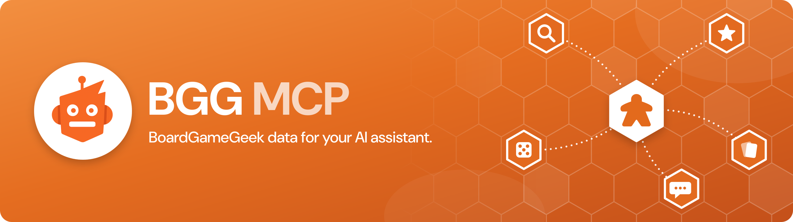

<a href="https://github.com/kkjdaniel/bgg-mcp"></a>

An MCP server that gives AI assistants access to BoardGameGeek: game details, collections, prices, recommendations and rules answers.

[](https://archestra.ai/mcp-catalog/kkjdaniel__bgg-mcp)
[](https://github.com/modelcontextprotocol/registry)
[](https://go.dev/)
[](LICENSE.md)
[](https://modelcontextprotocol.io)

BGG MCP provides access to the BoardGameGeek API through the [Model Context Protocol](https://www.anthropic.com/news/model-context-protocol), enabling retrieval and filtering of board game data, user collections, and profiles. The server is implemented in Go, using the [GoGeek](https://github.com/kkjdaniel/gogeek) library, which helps ensure robust API interactions.

Price data is provided by [BoardGamePrices.co.uk](https://boardgameprices.co.uk), offering real-time pricing from multiple retailers.

Game recommendations are powered by [Recommend.Games](https://recommend.games/), which provides algorithmic similarity recommendations based on BoardGameGeek data.

<a href="https://boardgamegeek.com/">
  
</a>

## Demo

<div align="center">
  
  [](https://youtu.be/cNX4WwVbFko)
  
  **[▶️ Watch the Rules Tool Demo Video](https://youtu.be/cNX4WwVbFko)**
  
</div>

## Tools

| Tool                 | Description                                                                             |
| -------------------- | --------------------------------------------------------------------------------------- |
| `bgg-search`         | Search for board games with type filtering (base games, expansions, or all)             |
| `bgg-details`        | Get detailed information about a specific board game                                    |
| `bgg-collection`     | Query and filter a user's game collection with extensive filtering options              |
| `bgg-hot`            | Get the current BGG hotness list                                                        |
| `bgg-user`           | Get user profile information                                                            |
| `bgg-price`          | Get current prices from multiple retailers using BGG IDs                                |
| `bgg-trade-finder`   | Find trading opportunities between two BGG users                                        |
| `bgg-recommender`    | Get game recommendations based on similarity to a specific game                         |
| `bgg-rules`          | Answer rules questions by finding the most relevant threads in a game's BGG rules forum |
| `bgg-thread-details` | Get the full content of a specific BGG forum thread including all posts                 |

## Resources

BGG MCP exposes resources that AI assistants can access directly for contextual information:

| Resource              | URI                           | Description                                                              |
| --------------------- | ----------------------------- | ------------------------------------------------------------------------ |
| `BGG Hotness`         | `bgg://hotness`               | Current BGG hotness list, always available                               |
| `My BGG Collection`   | `bgg://my-collection`         | Your personal BGG collection (only listed when `BGG_USERNAME` is set)    |
| `BGG User Collection` | `bgg://collection/{username}` | The owned games in any BGG user's collection                             |
| `BGG Game`            | `bgg://game/{id}`             | Essential information about a game by its BGG ID                         |
| `BGG Forum Thread`    | `bgg://thread/{id}`           | A BGG forum thread by its ID, with every post as plain text              |

## Prompts

BGG MCP includes pre-configured prompts for common workflows:

| Prompt                 | Arguments                                                    | Description                                                                              |
| ---------------------- | ------------------------------------------------------------ | ---------------------------------------------------------------------------------------- |
| `trade-sales-post`     | `username`, `currency`, `destination`, `discount`, `platform` | Generate a sales post for your BGG 'for trade' collection, discounted from retail prices |
| `game-recommendations` | `username`, `currency`, `destination`                        | Get personalized game recommendations based on your BGG collection and preferences       |
| `rules-question`       | `game`, `question`                                           | Answer a rules question from the game's BGG rules forum                                  |

`username` is optional on both prompts when `BGG_USERNAME` is set.

## Example Prompts

Here are some example prompts you can use to interact with the BGG MCP tools:

### 🔍 Search

```
"Search for Wingspan on BGG"
"How many expansions does Grand Austria Hotel have?"
"Search for Wingspan expansions only"
```

### 📊 Game Details

```
"Get details for Azul"
"Show me information about game ID 224517"
"What's the BGG rating for Gloomhaven?"
```

### 📚 Collection

```
"Show me ZeeGarcia's game collection"
"Show games rated 9+ in kkjdaniel's collection"
"List unplayed games in rahdo's collection"
"Find games for 6 players in kkjdaniel's collection"
"Show me all the games rated 3 and below in my collection"
"What games in my collection does rahdo want?"
"What games does kkjdaniel have that I want?"
```

### 🔥 Hotness

```
"Show me the current BGG hotness list"
"What's trending on BGG?"
```

### 👤 User Profile

```
"Show me details about BGG user rahdo"
"When did user ZeeGarcia join BGG?"
"How many buddies do I have on bgg?"
```

### 💰 Prices

```
"Get the best price for Wingspan in GBP"
"Show me the best UK price for Ark Nova"
"Compare prices for: Wingspan & Ark Nova"
```

### 🎯 Recommendations

```
"Recommend games similar to Wingspan"
"What games are like Azul but with at least 1000 ratings?"
"Find 5 games similar to Troyes"
```

### 📖 Rules

```
"In Wingspan, do pink powers trigger on my own turn?"
"Can I trade with the bank during another player's turn in Catan?"
"What happens when the deck runs out in Ark Nova?"
"How does line of sight work in Gloomhaven?"
```

## Installation

> **Authentication Required**: Most BGG MCP tools require authentication to access BoardGameGeek's API. See the [Configuration section](#configuration) below for setup instructions.

### A) Docker (Recommended)

BGG MCP is published to [Docker Hub](https://hub.docker.com/r/kdaniel/bgg-mcp) and listed on the [MCP Registry](https://github.com/modelcontextprotocol/registry). Add the following to your `claude_desktop_config.json` (Claude Desktop) or `settings.json` (VS Code / Cursor):

```json
"bgg": {
    "command": "docker",
    "args": ["run", "-i", "--rm", "--pull=always",
        "-e", "BGG_API_KEY",
        "-e", "BGG_USERNAME",
        "kdaniel/bgg-mcp"
    ],
    "env": {
        "BGG_API_KEY": "your_api_key_here",
        "BGG_USERNAME": "your_bgg_username"
    }
}
```

> See [Configuration](#configuration) below for details on obtaining a BGG API key and setting up your username.

`--pull=always` fetches the newest image each time the server starts, so you stay up to date automatically. Remove it if you need to start the server offline.

For more details on connecting MCP servers to your client, see the [official MCP guide](https://modelcontextprotocol.io/docs/develop/connect-local-servers).

### B) Manual Setup

#### 1. Install Go

You will need to have Go installed on your system to build binary. This can be easily [downloaded and setup here](https://go.dev/doc/install), or you can use the package manager that you prefer such as Brew.

#### 2. Build

The project includes a Makefile to simplify building and managing the binary.

```bash
# Build the application (output goes to build/bgg-mcp)
make build

# Clean build artifacts
make clean

# Both clean and build
make all
```

Or you can simply build it directly with Go...

```bash
go build -o build/bgg-mcp
```

#### 3. Add MCP Config

In the `settings.json` (VS Code / Cursor) or `claude_desktop_config.json` add the following to your list of servers, pointing it to the binary you created earlier, once you load up your AI tool you should see the tools provided by the server connected:

```json
"bgg": {
    "command": "path/to/build/bgg-mcp",
    "args": ["-mode", "stdio"]
}
```

More details for configuring Claude can be [found here](https://modelcontextprotocol.io/quickstart/user).

## Configuration

### Authentication

BGG MCP uses the GoGeek v3 library, which requires authentication for access to BoardGameGeek's API.

You can configure authentication using **either** `BGG_API_KEY` (recommended) or `BGG_COOKIE`:

#### Authentication Setup

##### Option 1: API Key (Recommended)

Get an API key from [BoardGameGeek's API application form](https://boardgamegeek.com/applications) and add it to your configuration:

```json
"bgg": {
    "env": {
        "BGG_API_KEY": "your_api_key_here"
    }
}
```

##### Option 2: Cookie Authentication

Alternatively, you can use cookie-based authentication:

```json
"bgg": {
    "env": {
        "BGG_COOKIE": "bggusername=user; bggpassword=pass; SessionID=xyz"
    }
}
```

**Note**: If both are provided, `BGG_API_KEY` will be used by default.

### Username Configuration

You can optionally set the `BGG_USERNAME` environment variable to enable "me" and "my" references in queries without needing to explicitly state your username:

```json
"bgg": {
    "env": {
        "BGG_USERNAME": "your_bgg_username",
        "BGG_API_KEY": "your_api_key_here"
    }
}
```

This enables:

- **Collection queries**: "Show my collection" instead of specifying your username
- **User queries**: "Show my BGG profile"
- **AI assistance**: The AI can automatically use your username for comparisons and analysis

**Note**: When you use self-references (me, my, I) without setting BGG_USERNAME, you'll get a clear error message.
