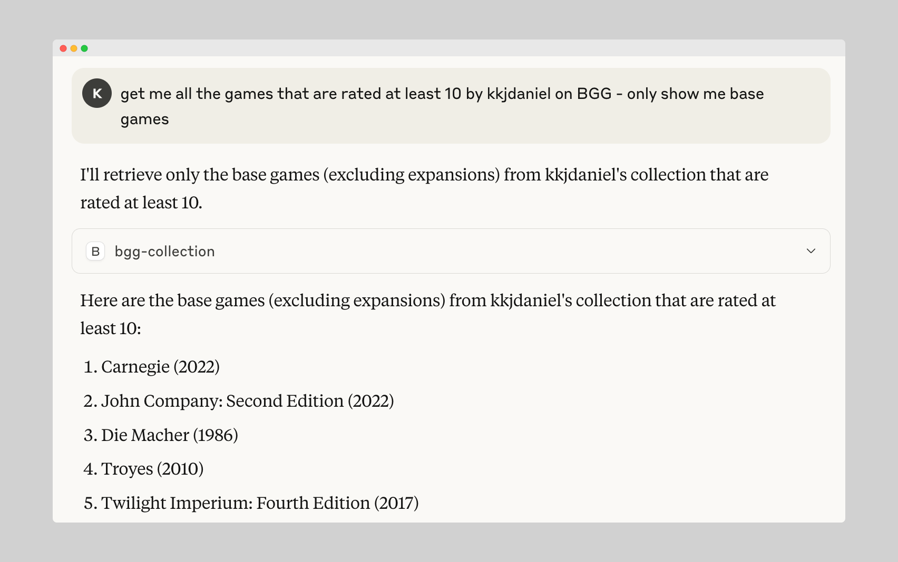
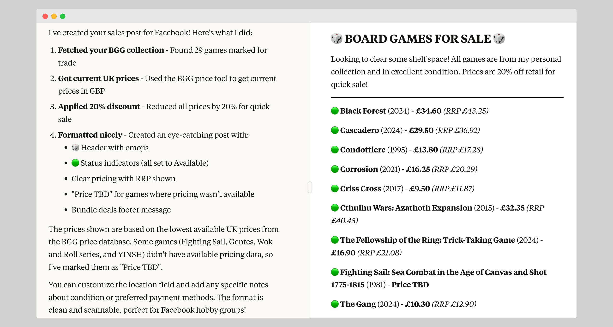

<p align="center">
  
</p>

# BGG MCP: BoardGameGeek MCP API Server

[](https://archestra.ai/mcp-catalog/kkjdaniel__bgg-mcp)
[](https://smithery.ai/server/@kkjdaniel/bgg-mcp)
[](https://go.dev/)
[](LICENSE)
[](https://modelcontextprotocol.io)

BGG MCP provides access to the BoardGameGeek API through the [Model Context Protocol](https://www.anthropic.com/news/model-context-protocol), enabling retrieval and filtering of board game data, user collections, and profiles. The server is implemented in Go, using the [GoGeek](https://github.com/kkjdaniel/gogeek) library, which helps ensure robust API interactions.

Price data is provided by [BoardGamePrices.co.uk](https://boardgameprices.co.uk), offering real-time pricing from multiple retailers.

Game recommendations are powered by [Recommend.Games](https://recommend.games/), which provides algorithmic similarity recommendations based on BoardGameGeek data.

<a href="https://boardgamegeek.com/">
  
</a>

## Example



## Tools

- **Search** - Search for board games on BoardGameGeek with type filtering (base games, expansions, or all)
- **Game Details** - Get detailed information about a specific board game
- **Collection** - Query and filter a user's game collection with extensive filtering options
- **Hotness** - Get the current BGG hotness list
- **User** - Get user profile information
- **Price** - Get current prices from multiple retailers using BGG IDs
- **Trade Finder** - Find trading opportunities between two BGG users
- **Recommender** - Get game recommendations based on similarity to a specific game

## Prompts

- **trade-sales-post** - Generate a formatted sales post for your BGG 'for trade' collection with discounted market prices
- **game-recommendations** - Get personalized game recommendations based on your BGG collection and preferences



## Example Prompts

Here are some example prompts you can use to interact with the BGG MCP tools:

### 🔍 Search

```
"Search for Wingspan on BGG"
"How many expansions does Grand Austria Hotel have?"
"Search for Wingspan expansions only"
```

### 📊 Game Details

```
"Get details for Azul"
"Show me information about game ID 224517"
"What's the BGG rating for Gloomhaven?"
```

### 📚 Collection

```
"Show me ZeeGarcia's game collection"
"Show games rated 0+ in kkjdaniel's collection"
"List unplayed games in rahdo's collection"
"Find games for 6 players in kkjdaniel's collection"
"Show me all the games rate 3 and below in my collection"
"What games in my collection does rahdo want?"
"What games does kkjdaniel have that I want?"
```

### 🔥 Hotness

```
"Show me the current BGG hotness list"
"What's trending on BGG?"
```

### 👤 User Profile

```
"Show me details about BGG user rahdo"
"When did user ZeeGarcia join BGG?"
"How many buddies do I have on bgg?"
```

### 💰 Prices

```
"Get the best price for Wingspan in GBP"
"Show me the best UK price for Ark Nova"
"Compare prices for: Wingspan & Ark Nova"
```

### 🎯 Recommendations

```
"Recommend games similar to Wingspan"
"What games are like Azul but with at least 1000 ratings?"
"Find 5 games similar to Troyes"
```

## Setup

You have two options for setting up, the easiest is to use the integration of Smithery.

### A) Installing via Smithery

To install bgg-mcp for Claude Desktop automatically via [Smithery](https://smithery.ai/server/@kkjdaniel/bgg-mcp):

```bash
npx -y @smithery/cli install @kkjdaniel/bgg-mcp --client claude
```

### B) Manual Setup

#### 1. Install Go

You will need to have Go installed on your system to build binary. This can be easily [downloaded and setup here](https://go.dev/doc/install), or you can use the package manager that you prefer such as Brew.

#### 2. Build

The project includes a Makefile to simplify building and managing the binary.

```bash
# Build the application (output goes to build/bgg-mcp)
make build

# Clean build artifacts
make clean

# Both clean and build
make all
```

Or you can simply build it directly with Go...

```bash
go build -o build/bgg-mcp
```

#### 3. Add MCP Config

In the `settings.json` (VS Code / Cursor) or `claude_desktop_config.json` add the following to your list of servers, pointing it to the binary you created earlier, once you load up your AI tool you should see the tools provided by the server connected:

```json
"bgg": {
    "command": "path/to/build/bgg-mcp",
    "args": ["-mode", "stdio"]
}
```

#### HTTP Mode (For Deployment)

The server also supports HTTP mode using SSE (Server-Sent Events) transport for scalable deployments:

```bash
# Run with default port 8080
./bgg-mcp -mode http

# Run with custom port
./bgg-mcp -mode http -port 3000

# Or use environment variables
MCP_MODE=http MCP_PORT=3000 ./bgg-mcp
```

When running in HTTP mode:
- SSE endpoint: `http://localhost:8080/mcp/sse`
- Message endpoint: `http://localhost:8080/mcp/message`

The Docker container runs in HTTP mode by default on port 8080.

More details for configuring Claude can be [found here](https://modelcontextprotocol.io/quickstart/user).

## Optional Configuration

### Username Configuration (Optional)

You can optionally set the `BGG_USERNAME` environment variable to enable "me" and "my" references in queries:

```json
"bgg": {
    "command": "path/to/build/bgg-mcp",
    "args": [],
    "env": {
        "BGG_USERNAME": "your_bgg_username"
    }
}
```

This enables:

- **Collection queries**: "Show me my collection" instead of specifying your username
- **User queries**: "Show me my BGG profile"
- **AI assistance**: The AI can automatically use your username for comparisons and analysis

**Note**: When you use self-references (me, my, I) without setting BGG_USERNAME, you'll get a clear error message.
